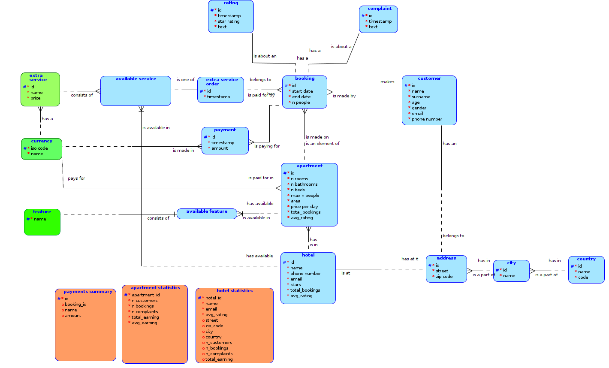

# Data Model

## Conceptual Model

## Relational Model

## Denormalization
The model is denormalized to speed up selected operations.

Attributes `hotel.avg_rating` and `apartment.avg_rating` are updated by a trigger after changes in the `rating` table.

Attributes `hotel.total_bookings` and `apartment.total_bookings` are updated by a trigger after changes in the `booking` table.