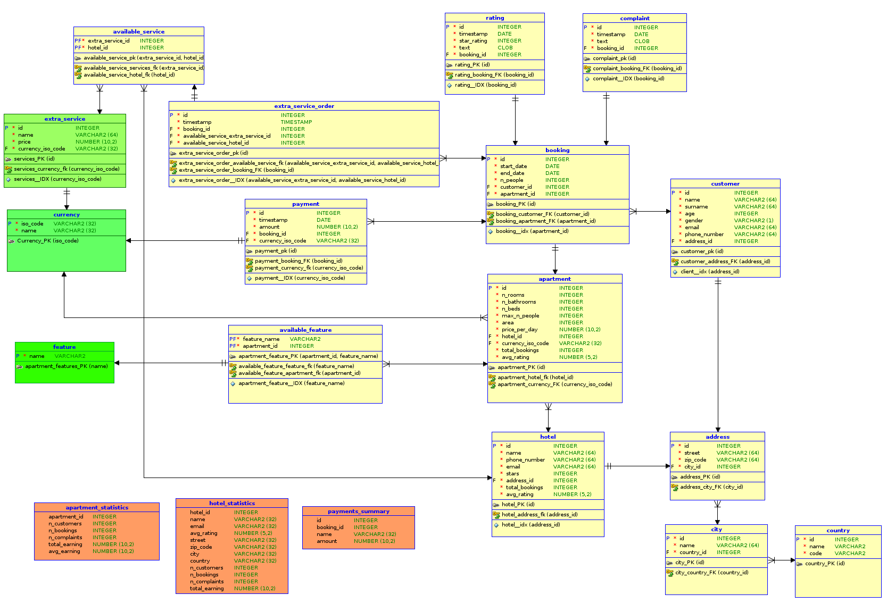

# Model danych

## Model pojęciowy

## Model relacyjny

## Denormalizacja
Model jest zdenormalizowany dla przyspieszenia wybranych operacji

Atrybuty `hotel.avg_rating` i `apartment.avg_rating` są aktualizowane wyzwalaczem po zmianie w tabeli `rating`.

Atrybuty `hotel.total_bookings` `apartment.total_bookings` są aktualizowane wyzwalaczem po zmianie w tabeli `booking`.